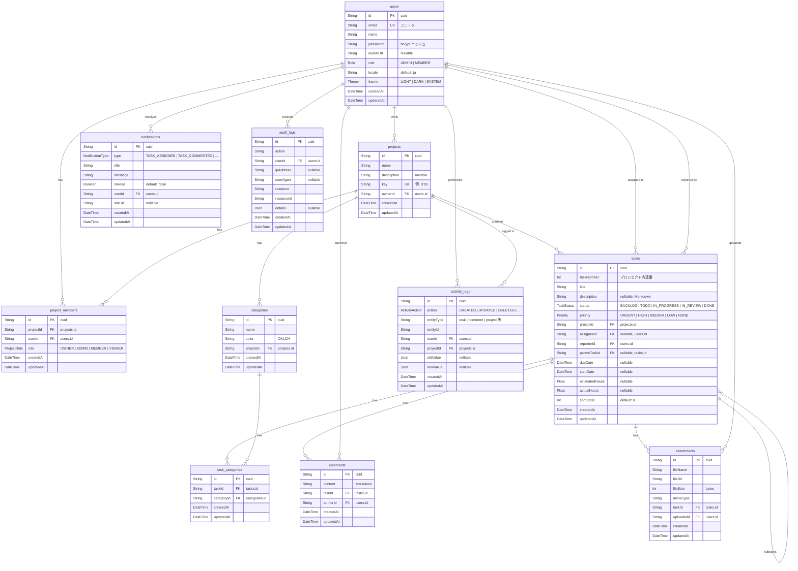

# ER図（Entity Relationship Diagram）

Prisma スキーマ（`prisma/schema.prisma`）に基づく全11テーブルのER図。

## テーブル一覧

| # | テーブル名 | Prisma モデル | 説明 |
|---|-----------|--------------|------|
| 1 | users | User | ユーザー |
| 2 | projects | Project | プロジェクト |
| 3 | project_members | ProjectMember | プロジェクトメンバー（多対多） |
| 4 | tasks | Task | タスク |
| 5 | categories | Category | カテゴリ |
| 6 | task_categories | TaskCategory | タスク-カテゴリ（多対多） |
| 7 | comments | Comment | コメント |
| 8 | attachments | Attachment | 添付ファイル |
| 9 | activity_logs | ActivityLog | アクティビティログ |
| 10 | notifications | Notification | 通知 |
| 11 | audit_logs | AuditLog | 監査ログ |

## リレーション一覧

| 親テーブル | 子テーブル | 関係 | 外部キー | ON DELETE |
|-----------|-----------|------|---------|-----------|
| users | projects | 1:N | ownerId | CASCADE |
| users | project_members | 1:N | userId | CASCADE |
| projects | project_members | 1:N | projectId | CASCADE |
| projects | tasks | 1:N | projectId | CASCADE |
| users | tasks | 1:N | assigneeId | SET NULL |
| users | tasks | 1:N | reporterId | CASCADE |
| tasks | tasks | 1:N (self) | parentTaskId | CASCADE |
| projects | categories | 1:N | projectId | CASCADE |
| tasks | task_categories | 1:N | taskId | CASCADE |
| categories | task_categories | 1:N | categoryId | CASCADE |
| tasks | comments | 1:N | taskId | CASCADE |
| users | comments | 1:N | authorId | CASCADE |
| tasks | attachments | 1:N | taskId | CASCADE |
| users | attachments | 1:N | uploaderId | CASCADE |
| users | activity_logs | 1:N | userId | CASCADE |
| projects | activity_logs | 1:N | projectId | CASCADE |
| users | notifications | 1:N | userId | CASCADE |
| users | audit_logs | 1:N | userId | CASCADE |
